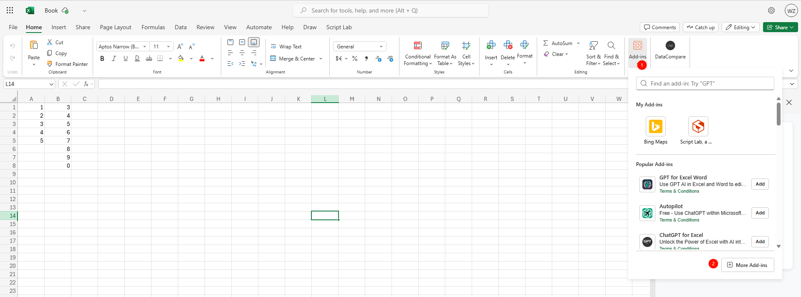
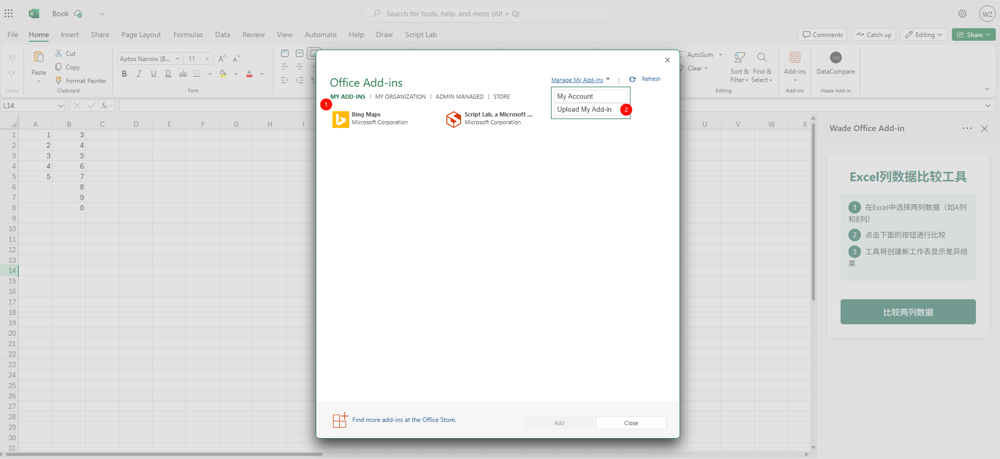
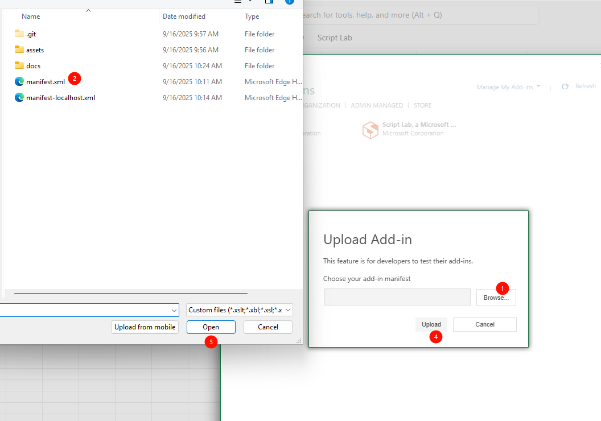
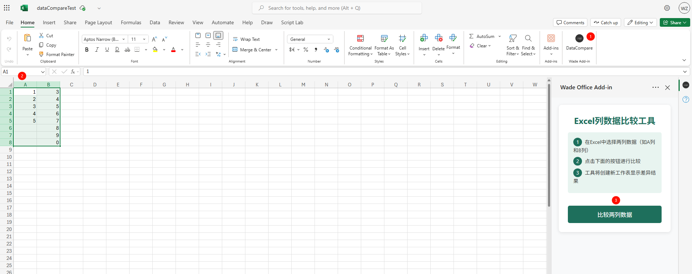

## 架构方案
1. 创建HTML文件
2. 推送到github
3. 使用github Page功能，完成HTML文件部署
4. 配置mainfest文件访问github page的html文件
5. 实现在add-in中调用网页端js能力，实现excel功能扩咱

# 使用教程

## 代码库文件
https://github.com/zdhzhongtao/WadeOfficeAddIn

## 使用的代码文件是
manifest.xml

## 部署的文件
https://zdhzhongtao.github.io/WadeOfficeAddIn/

## 导入Add-in

## 使用
